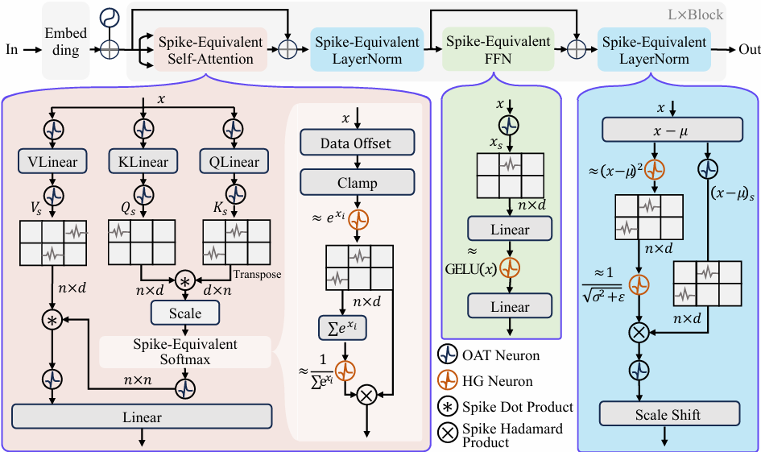

# LAS: Loss-less ANN-SNN Conversion for Fully Spike-Driven Large Language Models

This is the code implementation for the paper "LAS: Loss-less ANN-SNN Conversion for Fully Spike-Driven Large Language Models".




## Requirements

- `transformers==4.40.0.dev0`
- `accelerate >= 0.12.0`
- `torch >= 1.3`
- `datasets >= 2.14.0`
- `sentencepiece != 0.1.92`
- `protobuf`
- `evaluate`
- `scikit-learn`
## Checkpoints 
We have uploaded the pre-trained BERT checkpoints used in the paper to Hugging Face.
| Task | Hugging Face Model Name | Link |
|------|--------------------------|------|
| QQP  | lgccccc/bert-las-qqp     | [Link](https://huggingface.co/lgccccc/bert-las-qqp) |
| MNLI | lgccccc/bert-las-mnli    | [Link](https://huggingface.co/lgccccc/bert-las-mnli) |
| SST2 | lgccccc/bert-las-sst2    | [Link](https://huggingface.co/lgccccc/bert-las-sst2) |
| QNLI | lgccccc/bert-las-qnli    | [Link](https://huggingface.co/lgccccc/bert-las-qnli) |
| RTE  | lgccccc/bert-las-rte     | [Link](https://huggingface.co/lgccccc/bert-las-rte) |
| MRPC | lgccccc/bert-las-mrpc    | [Link](https://huggingface.co/lgccccc/bert-las-mrpc) |
| STSB | lgccccc/bert-las-stsb    | [Link](https://huggingface.co/lgccccc/bert-las-stsb) |

you can load the models by simply replacing `model_name_or_path` in the following command-line instructions with the corresponding Hugging Face model name. 
Alternatively, you can download the files directly from the “Files and versions” tab on each model page, or clone the entire repository using Git LFS, e.g., git lfs install && git clone https://huggingface.co/lgccccc/bert-las-qqp.
## Get BERT Model

```bash
export TASK_NAME=sst2

python run_glue.py \
  --model_name_or_path google-bert/bert-base-cased \
  --task_name $TASK_NAME \
  --do_train \
  --do_eval \
  --max_seq_length 128 \
  --per_device_train_batch_size 32 \
  --per_device_eval_batch_size 16 \
  --learning_rate 2e-5 \
  --num_train_epochs 3 \
  --save_steps 100 \
  --output_dir  /tmp/$TASK_NAME/ \
  --overwrite_output_dir \
  --fp16 \
  --fp16_full_eval
```

where task name can be one of cola, sst2, mrpc, stsb, qqp, mnli, qnli, rte, wnli.

## Test on ANN

```bash
export TASK_NAME=sst2

python run_glue.py \
  --model_name_or_path /tmp/$TASK_NAME/ \
  --task_name $TASK_NAME \
  --do_eval \
  --max_seq_length 128 \
  --per_device_train_batch_size 32 \
  --per_device_eval_batch_size 16 \
  --learning_rate 2e-5 \
  --num_train_epochs 3 \
  --save_steps 50000 \
  --output_dir /tmp/$TASK_NAME/ \
  --overwrite_output_dir \
  --fp16 \
  --fp16_full_eval
```

## Test on SNN

```bash
export TASK_NAME=sst2

python run_glue_LAS.py \
  --model_name_or_path /tmp/$TASK_NAME/ \
  --task_name $TASK_NAME \
  --do_eval \
  --max_seq_length 128 \
  --per_device_train_batch_size 32 \
  --per_device_eval_batch_size 16 \
  --learning_rate 2e-5 \
  --num_train_epochs 3 \
  --save_steps 50000 \
  --output_dir /tmp/$TASK_NAME/ \
  --overwrite_output_dir \
  --fp16 \
  --fp16_full_eval
```

## Multimodal

```
cd multimodal/LLaMA-Factory
pip install -e .

cd multimodal/evalscope
pip install -e .
```

Run

```
API_PORT=8000 CUDA_VISIBLE_DEVICES=0 llamafactory-cli api examples/inference/llava1_5.yaml

python evalscope/run_eval.py
```

## Reference

```
@article{chen2025loss,
  title={LAS: Loss-less ANN-SNN Conversion for Fully Spike-Driven Large Language Models},
  author={Chen, Long and Song, Xiaotian and Sun, Yanan},
  journal={arXiv preprint arXiv:2505.09659},
  year={2025}
}
```
